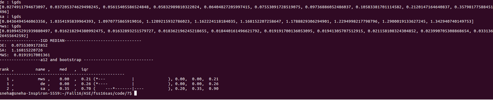
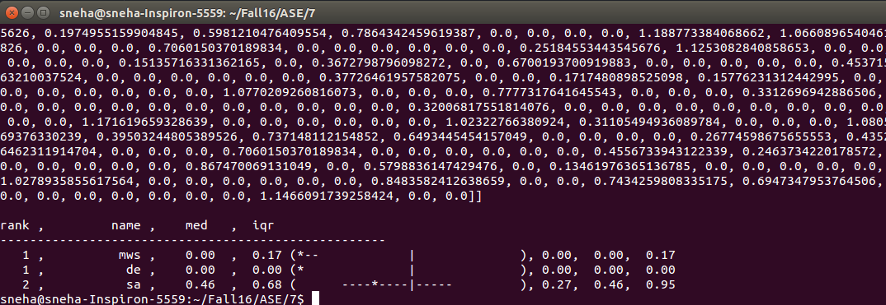
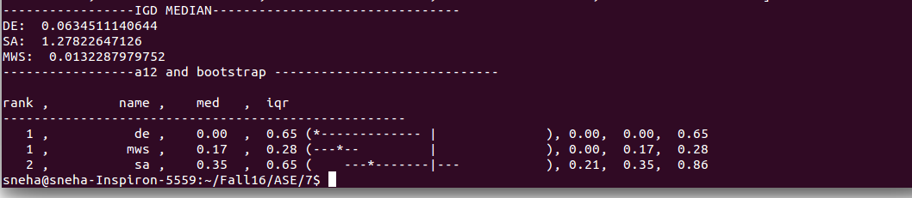

#**Code 7: Ranking of optimizers for DTLZ7 with 2 objectives and 10 decisions**

#####**Ankur Kataria (akatri2) , Shalini Sejwani (smsejwan), Sneha Shah (smshah4)**

#####**Directions to run Code 7**

* Run python main.py to compute the median performance as well as to produce the rankings returned by Scott-Knott

###**Abstract**

Any model, when run with different optimizers, yields varied objectives and decisions. To identify the best optimizer, for which the model is being reduced or expanded to the target minimum or maximum, can be found by comparing the results of all the optimizers using any of the known performance measures like Intergenerational Distance(IGD), Hypervolume, Spread. This coding project works with the DTLZ7 model , on which Simulated Annealing, Max Walk Sat and Differential Evolution are performed. Also the concept of early termination is used to reduce the computation cost if theres is no improvement from one era to next. These results are compared based on the type comparators to provide a ranked output of the optimizers for this particular model.

###**Introduction**

This homework considers the DTLZ7 model with 10 decisions and 2 objectives. The optimizers operating on the models aim at obtaining the global minima of the objectives. Three optimizers, namely, Simulated Annealing, Max Walk Sat and Differential Evolution are ranked based on the results they obtain for this chosen model based on the three ways that they are compared. The comparison operations are explained in detail ahead.

####**Simulated Annealing**

This optimizer avoids the settling of the model objective values at local minima by jumping to suboptimal points while the temperature is still low. The number of iterations is initially fixated and the temperature is set at zero and increased every iteration. An initial model object instance is created which is considered as the best candidate with best objectives. For each iteration, the model is newly instantiated. The objectives of the generated candidate is compared with the best, and if proven better, updates the best to hold the values of itself. A random value is generated and checked if it is greater than the probability function, which determines if the candidate should remain where it is or take a risk of jumping to a worse solution. The function takes the parameters of the old and new objective values of candidates and the temperature. The old value is copied to the new value if the probability function returns true, or else, remains at the new candidate. This repeats for all iterations or until it has lives remaining. The number of lives to be added or subtracted, and the candidate comparisons are performed by type 1 comparisons, which are described later in detail.

####**Max Walk Sat**

Max Walk Sat is a non-parametric stochastic algorithm, which deals with analyzing the landscape of the data. Similar to Simulated Annealing, it prevents local minima by making jumps to random worse points. If the spread of the data is bumpy, this optimizer works most efficiently. It starts off by setting a maximum number of tries and changes, defining the number of iterations for which the optimizers runs (without early termination). Creation of object instance and shuffling it with the best instance to finally store the best energy seen so far occurs similar to SA. In addition to this, a probability is set and is checked if the generated random value is lesser. If so, the optimizer is still at it's early stages and can afford to jump to worse points to escape local minima. Thus, a decision is picked at random and changed. Else, the random decision is changed to obtain the best energy. The optimizer provides an output of the best combination of decisions and objectives.

####**Differential Evolution**

This optimizer works in an intelligent manner by generating frontiers and ruling out bad decisions by binary or continuous domination mechanisms. It assumes that the final era or frontier is the best if it is dominated by at least one but worse of none of the previous values. It additionally takes an input of probability of crossover and extrapolate amount. The former decides the probability at which the other candidates should be extrapolated and the latter defines the ratio of extrapolation. Initially, a frontier of random candidates is generated and is further entered into the iteration of repeats, to keep randomly picking any other three candidates besides itself for mutation and extrapolation, if the generated random value is within the probability of crossover. This finally yields the final frontier, which comprises of the best candidates with least objectives, in the case of minimization problem.

###**Implementation**

The project is divided mainly into 5 parts:
* Coding up the optimizers (Simulated Annealing, Max Walk Sat and Differential Evolution)
    * performing early termination within the optimizer , between the eras
* Coding up the model (DTLZ7)
* Running the model for each optimizer and store final frontiers for a number of repeats
* Rank the optimizers
    * based on the median(type 1) of IGD - the performance measure used  
    * Rank the optimizers based on the effect size test
    * Rank the optimizers based on the effect size test + hypothesis test (bootstrap)

Optimizers and models were coded up using the specifications as described. We compared the values of the current best with the current solution obtained based on the comparison or improvement in energy found from the objectives using just the comparison operator less than since it is a minimization problem. So the energy comparison was used to update the best candidate in each iteration. Two consecutive eras were compared based on the mean of the loss between the eras. If there is more than 1% improvement the lives are increased by 5 else, it is said to be converging and thus, lives are reduced by 1.

Now , In 1 run
  * we set a baseline population for all the three optimizers and obtain the final population. A pareto frontier is obtained for the 3 optimizers
  * We create a true frontier based on the 3 frontiers obtained
  * For each of the optimizer we obtain an IGD value (i.e. performance measure) . Thus we have 3 IGD values in one run , one for each optimizer
We repeat the above for 20 times in our experiment, thus we have 20 IGD values for each of the optimizers.

####**Type1 - median performance**
Of the above 3 sets of IGD values obtained we find the median of each of the 3 sets and compare them. The optimizer with the least IGD has performed better.

####**Type2 - effect size test**
We obtain the initial population and final population sent and obtained from each of the optimizers. We find the loss in this for each optimizers and then perform the effect size test by using the Scott-Knott test. We have used the effect-size value of 0.56

####**Type3 - effect size test with hypothesis testing**
We repeat the above , i.e type 2 but in this case along with effect-size we also perform bootstrapping. After several runs we fixed the bootstrap value to 1000

###**Results**

Type 1 - median performance scores 2 runs

Upon successful completion of 20 iterations of each optimizer on the model, we find the median of all the IGDs for each optimizer. Thus we see that MWS and DE have very less IGD as compared to SA. So based on median MWS performs the best.
The results with and without early termination are similar and thus early termination does not affect the final out come thus reducinng the computation cost

Type 2 - Effect size test

Using this test a few times we repeatedly got MWS as the best optimizer for the current population and other parameters set. Followed by DE.

Type 3 - Effect size with hypothesis

The performance of DE is being proven to be the best . Although there is not much difference in the scores of DE and MWS in all the 3 types of comparison.

Thus our experiment of testing the optimizers for their performance, with and without early termination has proven that the performance  is best for MWS, closely followed by DE whereas SA left far behind in the race for the model DTLZ7 with 10 decisions and 2 objectives   

###**Threats to Validity**

There are a number of threats to validity in this concerned project.

* The results obtained are for minimal number of candidates and iterations in order to analyze the differences in performance metrics. These may vary and show more convergence if performed for prolonged iterations of larger populations. It is possible that the ranking of the optimizers shifts due to extended operations.

* The optimizers are run on a specific model only, DTLZ7. This model has objectives which differ from those of other objectives. The performances of the optimizers cannot be concluded as best, better and worse based on these results alone. They may perform differently on other models, based on the objectives and decisions encountered.

* Statistical Analysis of Scott-Knott is done based on the mean  of the euclidean distance of a candidate from its nearest neighbor of the baseline population. Thus the number of objectives get merged as a single value for easy comparison. Due to this, it is possible that the effective analysis gets disturbed.

###**Future Work**

Based on the threats of validity and shortcomings of this project, this analysis can be extended to include more precise opertions and results in the future. Some of them are listed below.

* These results have been obtained by running the optimizers on the model for 20 iterations each. This can be extended to include more number of iterations to get more accurate and precise results. Additionally, we used a population of 100 , the population size can be increased to have a larger spread of candidates.

* As of now we have only used IGD as the performance measure. In the future we could use Hypervolume and spread as well to compare these optimizers.

###**References**
<ol>
<li>
https://github.com/txt/mase/blob/master/src/doc/sk.py
</li>
<li>
https://github.com/txt/ase16/blob/master/doc/perform.md
</li>
</ol>
