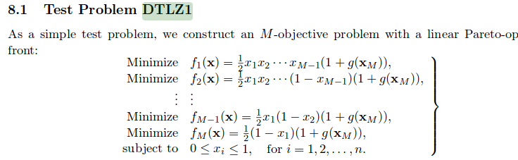
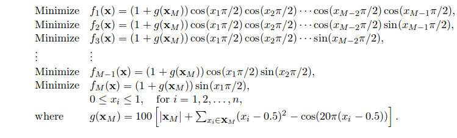
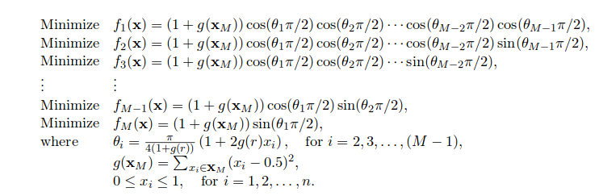
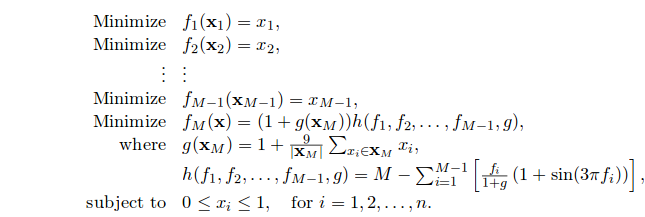
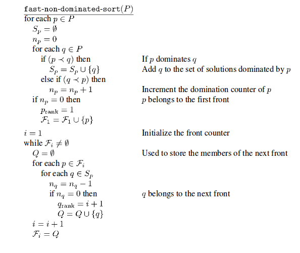
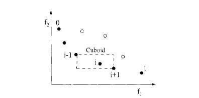

#**Code 8: NSGA-II with CDOM and BDOM + Cuboid distance secondary sorters**

#####**Ankur Kataria (akatri2) , Shalini Sejwani (smsejwan), Sneha Shah (smshah4)**

#####**Directions to run Code 9**
Run main.py that triggers all the DTLZ models one by one calling the NSGA-II optimizer

## Abstract

NSGA-II is a fast and elicit multi-objective Genetic Algorithm. The different genetic algorithms are mainly distinct from each other based on the way their selection algorithm works. In the NSGA-II algorithm there are two levels of selection, primary-sort is the fast-non-dominated-sort and secondary-sort is either continuous domination or binary domination + cuboid distance , the results of which are studied and compared. So in this we coded up all the DTLZ models DTLZ 1, 3, 5 and 7 and obtained the optimized results for DTLZ1,DTLZ3,DTLZ5 and DTLZ7 for 10,20,40 decisions and 2,4,6 and 8 objectives for both the secondary-sort operators, cdom and bdom+cuboid sort. The hypervolume of the objectives for all of them are compared and there doesn't seem to be some trend in the hypervolume values.


## Introduction

### Models

All models in this experiment come from the DTLZ family.

#### DTLZ1



DTLZ1 can be used with any number of objectives and decisions. The pareto frontier for this model is a straight line.

#### DTLZ3



DTLZ3 can be used with any number of objectives and decisions. The pareto frontier for this model is a downward sloping curved line.

#### DTLZ5


DTLZ5 can be used with any number of objectives and decisions. The pareto frontier for this model is also a downward sloping curved line. For some reason, this model became one of the most challenging ones for NSGA-II to fit, especially when dealing with higher numbers of objectives.

#### DTLZ7



DTLZ7 is a model created in order to test the potential for optimizers to find and maintain several distinct disjointed pareto-optimal solutions. As you can see, when using two objectives, x1 and x2, the pareto-optimal regions are spread out quite a bit. With DTLZ7 it is possible to implement the model using any number of objectives and any number of decisions.


### Genetic Algorithm
A Genetic Algorithm is a optimization algorithm which mimics the process of natural selection. In a genetic algorithm we use selection
to generate the best population, we then use mutationa and crosssover with the default probabilty to generate children. The children
are then compared to the parents to see if the population is getting evolved for better. Like natural selection , this process uses
crossover, mutation and selection.


The flow of genetic algorithm:
*Crossover (create children)
*Mutate (introduce some randomness)
*Select (Obtain fittest)


### NSGA-II

NSGA-II is another genetic algorithm where the method of selecting the population for each generation uses two level of sorts. Primary-sort and secondary-sort.

*Primary-sort uses fast-non-dominated-sort , the algorithm of which is as below



*secondary-sort uses either continuous domination or binary domination + cuboid-distance.

#### Cdom
Continuous domination can be compared to binary domination in that they are both use to compare the dominance of solutions. The difference is that continuous domination determines by how much one point in space dominates another. Instead of returning a binary "yes or no", cdom returns a value indicating how much one list dominates the other. With continuous domination, the differences between two lists are also increased by an exponential factor. As a result, points that dominate a solution by quite a bit stand out more than points that dominate solutions only by a slight margin. This can be used in sorting the population of genetic algorithms.
Candidate solutons that dominate points and have a higher cdom score are more likeley to get kept in a population than those with a lower cdom score.


#### Bdom + Cuboid
Cuboid distances are basically the sum of the vertical spaces between the closest candidates to a point. The cuboid distances for each point are compared against one another using binary domination.


Binary domination compares two solutions such that:
1. at least one objective in the first solution is better than any objective in the second solution
2. no objective in the first solution is worse than any objective in the second solution


### Result Analysis
#### Hypervolume
Hypervolume is volume within a pareto frontier. Essentially, hypervolume increases as the pareto frontier approaches closer to its overall goal.
The higher the hyper volume the better.


#### Scott-Knott
The Scott-Knot test is used for clustering results into similar categories. Scott-Knot recursively bi-clusters the output from each of the optimizers into ranks. At each level of ranks, another split is created where the expected values are the most different. Before continuing, Boostrap (random sampling) and A12 are called to check and see if the splits are significantly different<sup>[6]</sup>..

This is used in order to determine if there is a significant difference between the resulting hypervolumes for each algorithm.

## Implementation
NSGA-II is applied to DTLZ1, DTLZ3, DTLZ5, DTLZ7 with a variety  of configurations. Each model is tested with 10, 20 and 40 decisions with 2, 4, 6, and 8 objectives. Each permutation of models, the number of decisions and number of objectives are also executed with both Bdom + Cuboid and Cdom as secondary sorting operations. 20 Runs are executed for each permutation of model. After the execution of models, the hypervolume is measured for each optimized solution.

## Results
Each of the results below show an analysis of the hypervolumes generated by NSGA-II given the paramaters under the 'name' column. For example 'dtlz1 8 10 bdom' means NSGA-II optimized the model dtlz1 with 8 objectives and 10 decisions. Each of the hypervolumes are normalized by the number of objectives that the model used. The higher the number, the better the result.

```
sneha@sneha-Inspiron-5559:~/Fall16/ASE/fss16sas/code/8$ python main.py
rank ,         name ,    med   ,  iqr
----------------------------------------------------
   1 , dtlz1 2 10 bdom ,       0  ,     0 (*              |              ), 0.00,  0.00,  0.00,  0.00,  0.00
   1 , dtlz1 2 10 cdom ,       0  ,     0 (*              |              ), 0.00,  0.00,  0.00,  0.00,  0.00
   1 , dtlz1 2 20 bdom ,       0  ,     0 (*              |              ), 0.00,  0.00,  0.00,  0.00,  0.00
   1 , dtlz1 2 20 cdom ,       0  ,     0 (*              |              ), 0.00,  0.00,  0.00,  0.00,  0.00
   1 , dtlz1 2 40 bdom ,       0  ,     0 (*              |              ), 0.00,  0.00,  0.00,  0.00,  0.00
   1 , dtlz1 2 40 cdom ,       0  ,     0 (*              |              ), 0.00,  0.00,  0.00,  0.00,  0.00
   1 , dtlz1 4 10 bdom ,       0  ,     0 (*              |              ), 0.00,  0.00,  0.00,  0.00,  0.00
   1 , dtlz1 4 10 cdom ,       0  ,     0 (*              |              ), 0.00,  0.00,  0.00,  0.00,  0.00
   1 , dtlz1 4 20 bdom ,       0  ,     0 (*              |              ), 0.00,  0.00,  0.00,  0.00,  0.00
   1 , dtlz1 4 20 cdom ,       0  ,     0 (*              |              ), 0.00,  0.00,  0.00,  0.00,  0.00
   1 , dtlz1 4 40 bdom ,       0  ,     0 (*              |              ), 0.00,  0.00,  0.00,  0.00,  0.00
   1 , dtlz1 4 40 cdom ,       0  ,     0 (*              |              ), 0.00,  0.00,  0.00,  0.00,  0.00
   1 , dtlz1 6 10 bdom ,       0  ,     0 (*              |              ), 0.00,  0.00,  0.00,  0.00,  0.00
   1 , dtlz1 6 10 cdom ,       0  ,     0 (*              |              ), 0.00,  0.00,  0.00,  0.00,  0.00
   1 , dtlz1 6 20 bdom ,       0  ,     0 (*              |              ), 0.00,  0.00,  0.00,  0.00,  0.00
   1 , dtlz1 6 20 cdom ,       0  ,     0 (*              |              ), 0.00,  0.00,  0.00,  0.00,  0.00
   1 , dtlz1 6 40 bdom ,       0  ,     0 (*              |              ), 0.00,  0.00,  0.00,  0.00,  0.00
   1 , dtlz1 6 40 cdom ,       0  ,     0 (*              |              ), 0.00,  0.00,  0.00,  0.00,  0.00
   1 , dtlz1 8 10 bdom ,       0  ,     0 (*              |              ), 0.00,  0.00,  0.00,  0.00,  0.00
   1 , dtlz1 8 10 cdom ,       0  ,     0 (*              |              ), 0.00,  0.00,  0.00,  0.00,  0.00
   1 , dtlz1 8 20 bdom ,       0  ,     0 (*              |              ), 0.00,  0.00,  0.00,  0.00,  0.00
   1 , dtlz1 8 20 cdom ,       0  ,     0 (*              |              ), 0.00,  0.00,  0.00,  0.00,  0.00
   1 , dtlz1 8 40 bdom ,       0  ,     0 (*              |              ), 0.00,  0.00,  0.00,  0.00,  0.00
   1 , dtlz1 8 40 cdom ,       0  ,     0 (*              |              ), 0.00,  0.00,  0.00,  0.00,  0.00
   1 , dtlz3 2 10 bdom ,       0  ,     0 (*              |              ), 0.00,  0.00,  0.00,  0.00,  0.00
   1 , dtlz3 2 10 cdom ,       0  ,     0 (*              |              ), 0.00,  0.00,  0.00,  0.00,  0.00
   1 , dtlz3 2 20 bdom ,       0  ,     0 (*              |              ), 0.00,  0.00,  0.00,  0.00,  0.00
   1 , dtlz3 2 20 cdom ,       0  ,     0 (*              |              ), 0.00,  0.00,  0.00,  0.00,  0.00
   1 , dtlz3 2 40 bdom ,       0  ,     0 (*              |              ), 0.00,  0.00,  0.00,  0.00,  0.00
   1 , dtlz3 2 40 cdom ,       0  ,     0 (*              |              ), 0.00,  0.00,  0.00,  0.00,  0.00
   1 , dtlz3 4 10 bdom ,       0  ,     0 (*              |              ), 0.00,  0.00,  0.00,  0.00,  0.00
   1 , dtlz3 4 10 cdom ,       0  ,     0 (*              |              ), 0.00,  0.00,  0.00,  0.00,  0.00
   1 , dtlz3 4 20 bdom ,       0  ,     0 (*              |              ), 0.00,  0.00,  0.00,  0.00,  0.00
   1 , dtlz3 4 20 cdom ,       0  ,     0 (*              |              ), 0.00,  0.00,  0.00,  0.00,  0.00
   1 , dtlz3 4 40 bdom ,       0  ,     0 (*              |              ), 0.00,  0.00,  0.00,  0.00,  0.00
   1 , dtlz3 4 40 cdom ,       0  ,     0 (*              |              ), 0.00,  0.00,  0.00,  0.00,  0.00
   1 , dtlz3 6 10 bdom ,       0  ,     0 (*              |              ), 0.00,  0.00,  0.00,  0.00,  0.00
   1 , dtlz3 6 10 cdom ,       0  ,     0 (*              |              ), 0.00,  0.00,  0.00,  0.00,  0.00
   1 , dtlz3 6 20 bdom ,       0  ,     0 (*              |              ), 0.00,  0.00,  0.00,  0.00,  0.00
   1 , dtlz3 6 20 cdom ,       0  ,     0 (*              |              ), 0.00,  0.00,  0.00,  0.00,  0.00
   1 , dtlz3 6 40 bdom ,       0  ,     0 (*              |              ), 0.00,  0.00,  0.00,  0.00,  0.00
   1 , dtlz3 6 40 cdom ,       0  ,     0 (*              |              ), 0.00,  0.00,  0.00,  0.00,  0.00
   1 , dtlz3 8 10 bdom ,       0  ,     0 (*              |              ), 0.00,  0.00,  0.00,  0.00,  0.00
   1 , dtlz3 8 10 cdom ,       0  ,     0 (*              |              ), 0.00,  0.00,  0.00,  0.00,  0.00
   1 , dtlz3 8 20 bdom ,       0  ,     0 (*              |              ), 0.00,  0.00,  0.00,  0.00,  0.00
   1 , dtlz3 8 20 cdom ,       0  ,     0 (*              |              ), 0.00,  0.00,  0.00,  0.00,  0.00
   1 , dtlz3 8 40 bdom ,       0  ,     0 (*              |              ), 0.00,  0.00,  0.00,  0.00,  0.00
   1 , dtlz3 8 40 cdom ,       0  ,     0 (*              |              ), 0.00,  0.00,  0.00,  0.00,  0.00
   1 , dtlz5 2 40 cdom ,      67  ,     0 (*              |              ), 0.67,  0.67,  0.67,  0.67,  0.67
   1 , dtlz5 2 20 cdom ,      81  ,     0 (               |   *          ), 0.81,  0.81,  0.81,  0.81,  0.81
   1 , dtlz5 2 40 bdom ,      82  ,     0 (               |     *        ), 0.82,  0.82,  0.82,  0.82,  0.82
   1 , dtlz5 2 10 cdom ,      83  ,     0 (               |      *       ), 0.83,  0.83,  0.83,  0.83,  0.83
   1 , dtlz5 2 20 bdom ,      87  ,     0 (               |           *  ), 0.87,  0.87,  0.87,  0.87,  0.87
   1 , dtlz5 2 10 bdom ,      89  ,     0 (               |             *), 0.89,  0.89,  0.89,  0.89,  0.89
   1 , dtlz5 4 10 cdom ,      77  ,     0 (*              |              ), 0.77,  0.77,  0.77,  0.77,  0.77
   1 , dtlz5 4 20 cdom ,      91  ,     0 (       *       |              ), 0.91,  0.91,  0.91,  0.91,  0.91
   1 , dtlz5 4 10 bdom ,      98  ,     0 (          *    |              ), 0.98,  0.98,  0.98,  0.98,  0.98
   1 , dtlz5 4 40 cdom ,     100  ,     0 (           *   |              ), 1.00,  1.00,  1.00,  1.00,  1.00
   1 , dtlz5 4 20 bdom ,     109  ,     0 (               |*             ), 1.09,  1.09,  1.09,  1.09,  1.09
   1 , dtlz5 4 40 bdom ,     137  ,     0 (               |             *), 1.37,  1.37,  1.37,  1.37,  1.37
   1 , dtlz5 6 10 bdom ,      99  ,     0 (*              |              ), 0.99,  0.99,  0.99,  0.99,  0.99
   1 , dtlz5 6 10 cdom ,     105  ,     0 (   *           |              ), 1.05,  1.05,  1.05,  1.05,  1.05
   1 , dtlz5 6 20 bdom ,     115  ,     0 (          *    |              ), 1.16,  1.16,  1.16,  1.16,  1.16
   1 , dtlz5 6 20 cdom ,     115  ,     0 (           *   |              ), 1.16,  1.16,  1.16,  1.16,  1.16
   1 , dtlz5 6 40 cdom ,     133  ,     0 (               |      *       ), 1.33,  1.33,  1.33,  1.33,  1.33
   1 , dtlz5 6 40 bdom ,     144  ,     0 (               |             *), 1.44,  1.44,  1.44,  1.44,  1.44
   1 , dtlz5 8 10 bdom ,     101  ,     0 (*              |              ), 1.01,  1.01,  1.01,  1.01,  1.01
   1 , dtlz5 8 10 cdom ,     103  ,     0 ( *             |              ), 1.03,  1.03,  1.03,  1.03,  1.03
   1 , dtlz5 8 20 cdom ,     110  ,     0 (     *         |              ), 1.10,  1.10,  1.10,  1.10,  1.10
   1 , dtlz5 8 20 bdom ,     131  ,     0 (               |*             ), 1.31,  1.31,  1.31,  1.31,  1.31
   1 , dtlz5 8 40 cdom ,     137  ,     0 (               |    *         ), 1.37,  1.37,  1.37,  1.37,  1.37
   1 , dtlz5 8 40 bdom ,     154  ,     0 (               |             *), 1.54,  1.54,  1.54,  1.54,  1.54
   1 , dtlz7 2 20 cdom ,      69  ,     0 (*              |              ), 0.69,  0.69,  0.69,  0.69,  0.69
   1 , dtlz7 2 40 cdom ,      69  ,     0 (  *            |              ), 0.69,  0.69,  0.69,  0.69,  0.69
   1 , dtlz7 2 40 bdom ,      77  ,     0 (               |            * ), 0.77,  0.77,  0.77,  0.77,  0.77
   1 , dtlz7 2 10 cdom ,      77  ,     0 (               |             *), 0.77,  0.77,  0.77,  0.77,  0.77
   1 , dtlz7 2 20 bdom ,      77  ,     0 (               |             *), 0.77,  0.77,  0.77,  0.77,  0.77
   1 , dtlz7 2 10 bdom ,      77  ,     0 (               |             *), 0.77,  0.77,  0.77,  0.77,  0.77
   1 , dtlz7 4 40 bdom ,      57  ,     0 (*              |              ), 0.58,  0.58,  0.58,  0.58,  0.58
   1 , dtlz7 4 10 bdom ,      57  ,     0 ( *             |              ), 0.58,  0.58,  0.58,  0.58,  0.58
   1 , dtlz7 4 40 cdom ,      65  ,     0 (               |      *       ), 0.65,  0.65,  0.65,  0.65,  0.65
   1 , dtlz7 4 20 cdom ,      65  ,     0 (               |       *      ), 0.65,  0.65,  0.65,  0.65,  0.65
   1 , dtlz7 4 20 bdom ,      66  ,     0 (               |         *    ), 0.66,  0.66,  0.66,  0.66,  0.66
   1 , dtlz7 4 10 cdom ,      67  ,     0 (               |             *), 0.67,  0.67,  0.67,  0.67,  0.67
   1 , dtlz7 6 10 bdom ,      35  ,     0 (*              |              ), 0.35,  0.35,  0.35,  0.35,  0.35
   1 , dtlz7 6 10 cdom ,      41  ,     0 (               |   *          ), 0.41,  0.41,  0.41,  0.41,  0.41
   1 , dtlz7 6 40 bdom ,      42  ,     0 (               |      *       ), 0.42,  0.42,  0.42,  0.42,  0.42
   1 , dtlz7 6 20 cdom ,      44  ,     0 (               |           *  ), 0.44,  0.44,  0.44,  0.44,  0.44
   1 , dtlz7 6 20 bdom ,      44  ,     0 (               |             *), 0.44,  0.44,  0.44,  0.44,  0.44
   1 , dtlz7 6 40 cdom ,      45  ,     0 (               |             *), 0.45,  0.45,  0.45,  0.45,  0.45
   1 , dtlz7 8 20 cdom ,      18  ,     0 (*              |              ), 0.18,  0.18,  0.18,  0.18,  0.18
   1 , dtlz7 8 40 bdom ,      19  ,     0 (  *            |              ), 0.19,  0.19,  0.19,  0.19,  0.19
   1 , dtlz7 8 20 bdom ,      21  ,     0 (      *        |              ), 0.21,  0.21,  0.21,  0.21,  0.21
   1 , dtlz7 8 10 cdom ,      26  ,     0 (              *|              ), 0.26,  0.26,  0.26,  0.26,  0.26
   1 , dtlz7 8 40 cdom ,      26  ,     0 (              *|              ), 0.26,  0.26,  0.26,  0.26,  0.26
   1 , dtlz7 8 10 bdom ,      35  ,     0 (               |             *), 0.35,  0.35,  0.35,  0.35,  0.35

```

For DTLZ1 and DTLZ3 there is not any difference or relevant result value that are being produced . For DTLZ5 and DTLZ7 are producing some results
DTLZ5 turned out to be the only model that produced results that were statisticaly different from one another.
DTLZ7 is producing good results for 2 objectives for 10, 20 decisions  and  dtlz5 for 40 decisions and all the objectives also performed good.  Surprisingly  bdom+cuboid seems to perform better against the cdom sorting.

The results seem to be random
There appears to be no real difference between hypervolumes of models optimized with bdom + cuboid sorting verses models optimized  with cdom.

What is interesting to see is that as the number of objectives increases, the hypervolume for each optimized model also decreases. When running the experiment, it also appears that as the number of objectives increases, so to does the runtime of NSGA-II.


## Threats to Validity

* We ran the code only for the given default values . We could run the code for different sets of default values and try to decide which set of default paramters works the best.
* We use Hypervolume function to measure performance. There are multiple other tools which could be used. The given results might be skewed because of the use of Hypervolume.
* Only 20 runs of each model, objective and decision combination were used in order to produce results. More runs of each model may be needed in order to eleminate noise.
* Also we tested on only a few values of mutation and crossover rate as well as a population generations, due to long running times, thus changes in these defaults can help better study the results

## Future Work
* It would be worthwhile  to implement Spread and Intergenerational Distance as a final population fitness measurement in a addition to hypervolume. Perhaps Cdom and Bdom produce different values for Spread and IGD in a way that is not reflected in hypervolume.
* Also changing the number of generations and the population size that NSGA-II has available may help aid in understanding and study the results better.
* We havent implemented early termination in this, which can be implemented to improve on the computation time.


## References
<ol>
<li>
http://www.tik.ee.ethz.ch/file/c7c5e610a0c7e26d566a3601e5cce2f4/DTLZ2001a.pdf
</li>
<li>
http://people.ee.ethz.ch/~sop/download/supplementary/testproblems/
</li>
<li>
https://github.com/wreszelewski/nsga2/tree/master/nsga2
</li>
<li>
https://ls11-www.cs.uni-dortmund.de/rudolph/hypervolume/start
</li>
<li>
https://github.com/txt/ase16/blob/master/doc/perform.md
</li>
<li>
https://github.com/txt/ase16/blob/master/doc/stats.md</li>
</ol>
