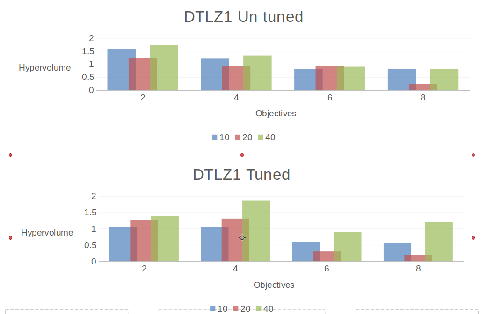
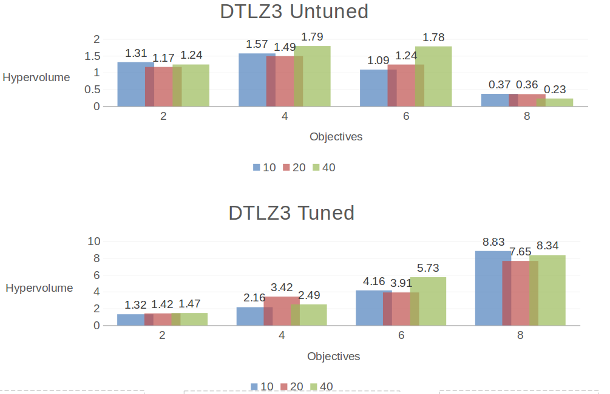
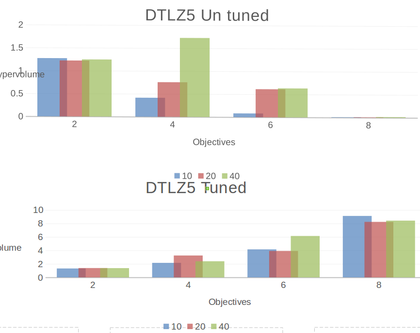
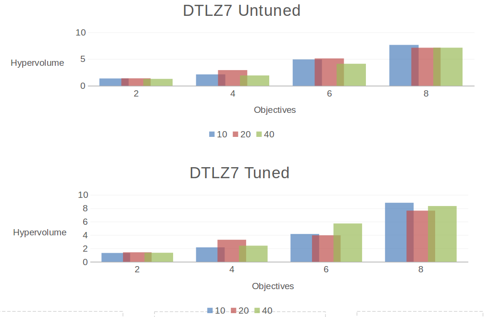

#**Code 9: Hyper Parameter Optimization**

#####**Ankur Kataria (akatri2) , Shalini Sejwani (smsejwan), Sneha Shah (smshah4)**

#####**Directions to run Code 9**

* Run python main.py and main1.py to compute the results of DTLZ1 and DTLZ3,5,7 respectively

##Hyper Parameter Optimization

###Abstract

For this study we used Differential Evolution(DE) to generate the set of values which decide the extend of mutation ,crossover ,
the number of candidates and the number of generations that a genetic algorithm(GA) will run. We use DE to tune our default control
settings. The DE tunes the GA so that the set of values which performs the most efficiently optimized solution for different
DTLZs get generated. We apply DE to tune our GAs which optimise DTLZ 1 , 3, 5 , 7 each time with 2,4,6,8 objectives and 10, 20
, 40 decision. We observe that tuning the GA via DE improves the performance of GA on DTLZ3 and DTLZ5 with 4,6,8 objectives and DTLZ7
for 8 objectives.

###Introduction
When we use Genetic Algorithm to optimise a problem ,there are a number of parameters which decide the extent of mutation ,
crossover that population size and so on which when set optimally can highly improve and influence the performance. So we run GA for DTLZ with the default random settings as well as with the tuned optimized settings and see the performace difference in this homework. Thus, In this study we apply Differential Evolution and generate different sets of default parameter settings. These are then used to run GA on DTLZ 1 , 3, 5 , 7 each time with 2,4,6,8 objectives and 10, 20 , 40 decisions. We analyze the performance of DE on the GAs by comparing the hypervolumes generated before and after the tuning is done.

###Differential Evolution
Differential evolution (DE) is a method that optimizes a problem by iteratively trying to improve a candidate solution with regard to
a given measure of quality. DE optimizes a problem by maintaining a population of candidate solutions and creating new candidate
solutions by combining existing ones according to its simple formulae, and then keeping whichever candidate solution has the best
score or fitness on the optimization problem at hand. In this way the optimization problem is treated as a black box that merely
provides a measure of quality given a candidate solution and the gradient is therefore not needed.

###Genetic Algorithm
A Genetic Algorithm is a optimization algorithm which mimics the process of natural selection. In a genetic algorithm we use selection
to generate the best population, we then use mutationa and crosssover with the default probabilty to generate children. The children
are then compared to the parents to see if the population is getting evolved for better. Like natural selection , this process uses
crossover, mutation and selection.

###Implementation

The project flow mainly goes as follows
* Using the optimizers (DE from code 7)
* Using DE tuning GA , by passing an object of GA to DE . The candidate function of the GA creates a frontier of parameter lists(mutation, crossover, etc). The DE tuned the GA for these parameters
* the max and min values for each of the default parameters were:
mutation repeatedly: 0.01 to 0.09
crossover rate: 0.50 to 0.99
number of lives: 5
number of candidates: 100 to 500
number of generations: 100 to 300  
frontier_distribution=0.4 to 0.9
* After tuning these paramters we run GA for all the DTLZ with the paramters for GA optimized.
* We also do the same run for default GA paramters
* For each of them the final frontier , i.e pareto frontier is compared to the initial frontier and the losses are obtained, which is used to see the improvement.
* This improvement in optimized GA parameters was compared for all the DTLZ models
* To check whether or not the DE tunes the GA well , we stored the hypervolumes for each run of GA on DTLZ 1 , 3, 5 , 7 each time with
2,4,6,8 objectives and 10, 20 , 40 decisions and plotted this on a graph.
* We also ran the untuned GAs and compared the graphs so as to compar eth performance before and after
the GA was applied on. The paramters for this run were :  
mutation rate: 0.05
crossover rate: 0.98
number of lives: 5
number of candidates: 100
number of generations: 200 (but have early termination considered every 100 generations)
frontier_distribution=0.8

The values for the range number of candidates was kept 200 for the untuned optimizer and between 100 to 300 for the tuned
optimizer so as to limit the time needed to run the code .

Similarly the default parameter for the DE were limited to
 number of generations = 10
 number of candidates =20
so as to save on the running time

###Results

For the different DTLZs with different number of objectives and decisions we have calculated the hypervolume and plotted it here.
For each DTLZ model the plot can be seen below . The number under the plot represents the number of objectives, while the
number 10, 20 , 40 represents the number of decisions.

####DTLZ1 - before and after optimization

Above is the plot for DTLZ1 for the different number of objectives and decisions. We can see from the graph that the hypervolume
values are getting reduced . Hence we can conclude that the DE doesn't optimize the GA for DLTZ1 .

####DTLZ3 - before and after optimization

The plot for DTLZ3 for the various number of objectives and decisions is shown above.  We can see from the graph that the hypervolume
numbers are getting improved significantly upto factor of 2 to 3 for 4,6,8 objectives. However this change is not very
significant for 2 objectives. Hence we can conclude that the DE optimizes the GA for DLTZ3 with 4,6,8 objectives to a significant
extent but not for 2 objectives.

####DTLZ5 - before and after optimization

Below is the plot for DTLZ5 for the different number of objectives and decisions.We can see from the graph that the hypervolume
numbers are getting improved significantly upto factor of 2 to 3 for 4,6,8 objectives. However this change is not very
significant for 2 objectives. Hence we can conclude that the DE optimizes the GA for DLTZ5 with 4,6,8 objectives to a significant
extent but not for 2 objectives.

####DTLZ7 - before and after optimization

Below is the plot for DTLZ7 for the different number of objectives and decisions. We can see from the graph that the hypervolume
numbers are getting improved significantly upto factor of 1 to 1.5 for 8 objectives . For 6 objectives , on an average this number
gets reduced. While there is no change for 2, 4 objectives .Hence we can conclude that the DE optimizes the GA for DLTZ7
to a significant extent for 8 objectives.Also , this number gets worsened for DTLZ7 with 2 objectives.

It can be observed from the graphs that optimizing the GA through DE produced a significant improvement in the
hypervolume values for some of the DTLZ cases but not for all.

###Conclusions
We can hence conclude that GA optimizes DE to a significant extent for DTLZ3 and DTLZ5 with 4,6,8 objectives and DTLZ7
for 8 objectives.
Tuning with DE worsens optimization achieved through DE for DTLZ1 and DTLZ7 for 2 objectives.

###Threats to Validity
1. We ran the code only for the given default values for DE. We could run the code for different sets of default values and try to
   decide which set of default paramters works the best.
2. We used only Hypervolume function to measure performance. There are multiple other tools which could be used. The given results might
   be skewed because of the use of Hypervolume.
3. The range of values for generating candidate solutions for GA's default settings were very narrow due to time limitations.
4. The code was run for a very limited number of iterations of both GA and DE because of time constraints.

###Future Work
1. The code simply takes hours to run , once. We can somehow use better algorithm and a faster mechanism to obtain results so that several other threats mentioned above can be easily confirmed.
1. The code could be run for more number of iterations for DE and for GA.
2. Instead of just using hypervolume , we could also use spread or the loss and compute multiple graphs. Instead on measuring
   performance based on just hypervolume , we could base it on all three of the parameters and then conclude results.
3. The range of values to generate candidate solutions can be made more wide.

###References:-

 1. [Pseudo-code for Genetic Algorithm](http://www.cleveralgorithms.com/nature-inspired/evolution/genetic_algorithm.html)
 2. https://github.com/txt/mase/blob/master/lessthan.md
 3. https://github.com/txt/mase/blob/master/STATS.md
 4. https://en.wikipedia.org/wiki/Genetic_algorithm
 5. https://github.com/txt/mase/blob/master/DE.md

###Acknowledgements

   The study uses code found here :
 1.  This study uses code for Scott Knott given here : https://github.com/txt/mase/blob/master/src/doc/sk.py
 2.  This study used Hypervolume functions given here:
     [Hypervolume Calculator](https://github.com/ai-se/storm/tree/master/PerformanceMetrics)
